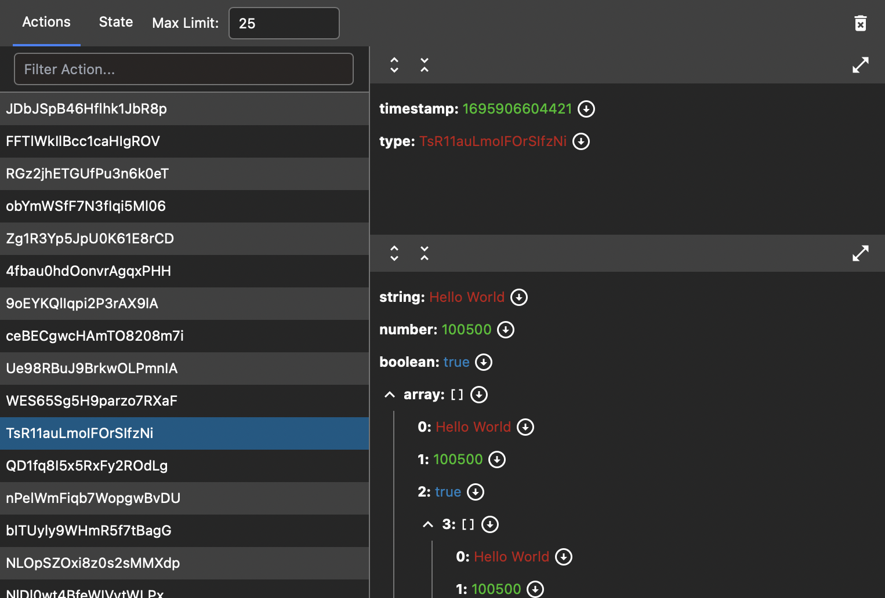

# Simple Redux Devtools

A very lightweight chrome extension to debug redux applications.
Main advantage of the extension is limited memory usage and on-demand json rendering.



Uses standard instrument mechanism to listen to events.

How to add devtools support see [angular](https://ngrx.io/guide/store-devtools) and [react](https://redux.js.org/usage/configuring-your-store#integrating-the-devtools-extension) examples.

## Build & Debug

To build extension use the following steps:

```
$> cd app && npm i
$> npm run build
```

To add extension to the Chrome:
1. Open chrome://extensions
2. Click `Load unpacked`
3. Navigate to the `extension` folder in the root folder of the repository
